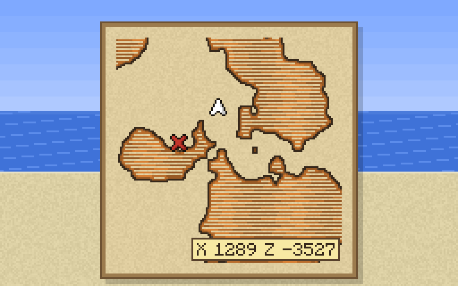
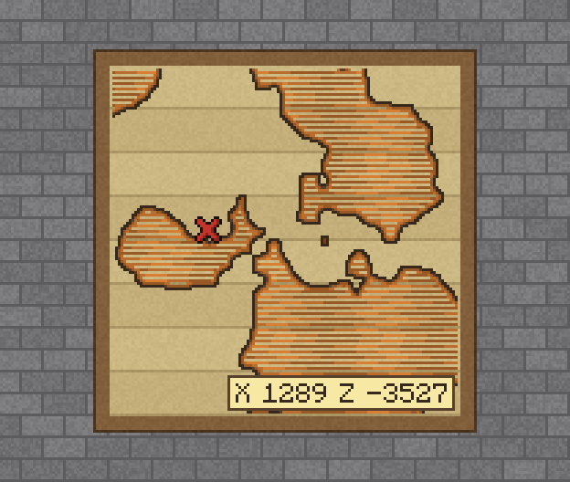

# X spot coordinates

A Paper 26.3 plugin that writes the X and Z of a treasure or explorer map's marker into a corner of the map. You can read where the X is instead of walking around until your arrow sits on it.

| Held in hand | In an item frame |
|---|---|
|  |  |

*The previews are mockups. The label is drawn exactly as the plugin draws it; the parchment, frame and icons are approximations of the game textures.*

## What it does

- **Exact coordinates.** Every treasure and explorer map item stores its marker's world position (the `map_decorations` component). The plugin reads that value, so the label shows the marker's exact X and Z. On a Buried Treasure Map that's the column the chest is buried in.
- **Everyone sees it.** The label is drawn into the map picture with the game's own map font, so it shows in hand and in item frames, with no client mod or resource pack. Copies of a map show it too.
- **Only maps with a marker.** Buried treasure, woodland, ocean, trial, jungle, swamp, village and the other explorer maps. Maps you craft and fill yourself stay vanilla.
- **Nothing is saved.** The item and the saved map data aren't changed. Remove the plugin and the maps look vanilla again. The game draws the X and the player arrow on top of the map picture, so the label never hides them.

## Settings

`plugins/XSpotCoordinates/config.yml`. Apply changes with `/xspot reload`.

| Key | Values | Default |
|---|---|---|
| `style` | `parchment` (light tag, brown border), `ink` (text with a light outline), `dark` (dark tag, light text) | `parchment` |
| `layout` | `one-line` (`X 1289 Z -3527`), `two-lines` (X above Z). Coordinates too long for one line use two. | `one-line` |
| `corner` | `auto` (the corner farthest from the marker), `top-left`, `top-right`, `bottom-left`, `bottom-right` | `auto` |
| `disabled-markers` | marker types to skip, e.g. `[red_x]` for buried treasure maps | `[]` |

## Commands

| Command | Permission | What it does |
|---|---|---|
| `/xspot` | `xspot.admin` (op) | Shows the current settings and how many maps got a label since startup |
| `/xspot reload` | `xspot.admin` (op) | Reloads `config.yml` and redraws every labelled map |

## How it works

| File | What it does |
|---|---|
| `XSpotCoordinatesPlugin.java` | Entry point, `/xspot` command |
| `LabelSettings.java` | Reads `config.yml` |
| `MapWatcher.java` | Finds maps with a marker (player inventories, item frames) and adds a renderer to each |
| `CoordinatesRenderer.java` | Bukkit `MapRenderer` that paints the label once per map and repaints it after a reload |
| `LabelPainter.java` | Label layout, corner choice and the pixel drawing with `MinecraftFont` |
| `Target.java` | The marker type and coordinates read from the item |

Renderers only exist in memory, so maps are found again after every restart: on join, on inventory events, by a light scan of players' hands (every 5 ticks) and inventories (every 2 seconds), and when item frames load with their chunk. The game only sends the parts of a map that changed, so a map that players may already have received is sent once in full when its renderer is added.

## Build

Requirements: JDK 21 or newer and Maven 3.9+.

```bash
mvn -DskipTests clean package
```

The jar is `target/x-spot-coordinates-<version>.jar`. Released jars are in `release/` and on the GitHub releases page.

## Install

Put the jar in the server's `plugins/` folder and restart. Paper 26.3 or newer.

## License

MIT, see [LICENSE](LICENSE).
